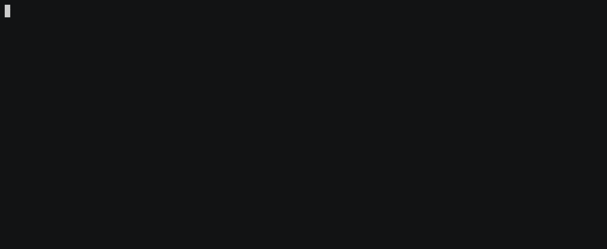

### Project #3 "Page loader"
***

### Tests and linter status:
[](https://github.com/ajib6ept/python-project-lvl3/actions)
[](https://github.com/ajib6ept/python-project-lvl3/actions)
[](https://codeclimate.com/github/ajib6ept/python-project-lvl3/maintainability)
[](https://codeclimate.com/github/ajib6ept/python-project-lvl3/test_coverage)
[](https://results.pre-commit.ci/latest/github/ajib6ept/python-project-lvl3/main)


This is the third project in the Python learning course [hexlet.io](https://ru.hexlet.io)

This package allows you to download web pages.
***
#### Installation
* Install [poetry](https://python-poetry.org/docs/#installation)
* ```git clone https://github.com/ajib6ept/python-project-lvl3.git```
* ```cd python-project-lvl3/ && make install```
* ```make build```
* ```make package-install```


***

#### Usage
* ```page-loader -o /tmp/hexlet https://github.com/ajib6ept```
***
###### Download web page 

